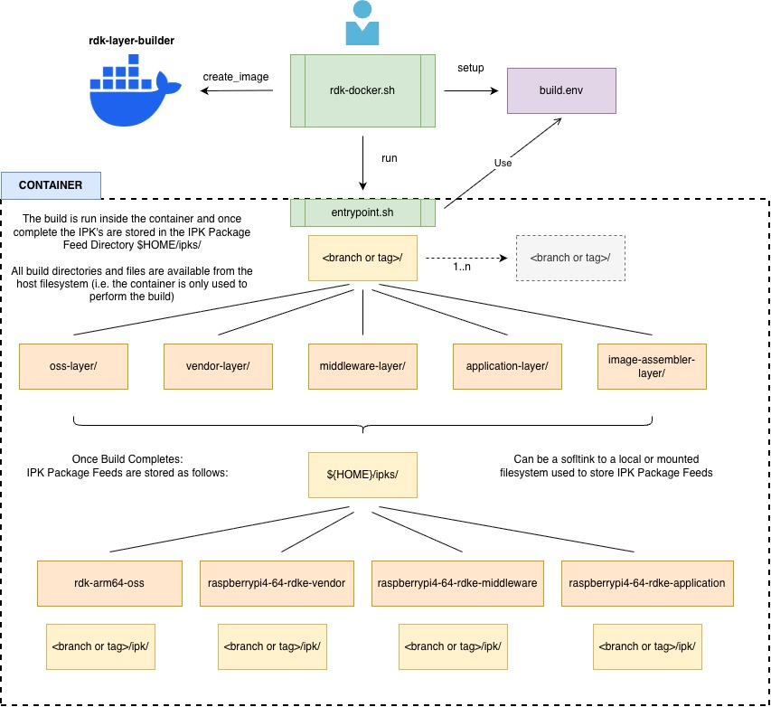

# RDK Docker Builder

## Introduction

RDK Docker Builder is a RDK Yocto development environment for building RDK-E RPI OSS, VENDOR, MIDDLEWARE, APPLICATION and IMAGE ASSEMBLER Layer Images. It can also be used to build the RDK8 factory firebolt applications (base bolt, wpe and reference ui).

This Docker can be used to build the [RDK7](https://wiki.rdkcentral.com/spaces/RDK/pages/407524261/RDK7+Release+Notes) and [RDK8](https://wiki.rdkcentral.com/spaces/RDK/pages/476317896/RDK8+Release+Notes) releases along and any active branch or tag for the different rdk video layers.

It is assumed the user is familiar with the RDK-E Layered Architeture. If not please see the latest RDK-E release notes for an overview:
[RDK-E Code Releases](https://wiki.rdkcentral.com/spaces/CMF/pages/414065624/RDK-E+Video+Code+Releases)

---
## Prerequisites

### Host Tools
The following should be installed on your host system

- [Docker](https://www.docker.com/get-started/)
- [Python 3](https://www.python.org/downloads/)
- [Python venv](https://docs.python.org/3/library/venv.html) 

### Storage Space
You will need sufficient storage space on the host filesystem to perform the builds and store the IPK's generated. The IPK's can be stored on a local or a remotely mounted filesystem. Estimated storage requirements per IPK Feed and Layer Builds are as follows:

**RDK 7** 
| Layer | Build Size | IPK Size|
| ----------- | ----------- | ----------- |
|OSS| 82GB | 860MB |
|VENDOR| 44GB | 183MB|
|Middleware| 118GB | 395MB|
|Application| 56GB | 6.3MB|
|Image Assembler| 27GB | NA |

**RDK 8** 
| Layer | Build Size | IPK Size| OSS IPK Size|
| ----------- | ----------- | ----------- | ----------- |
|VENDOR| 52GB | 200MB | 305 MB |
|Middleware| 51GB | 214MB | 413MB|
|Image Assembler| 27GB | NA |

*In RDK8 the OSS is built as part of vendor and middleware layers and there is no separate application layer.*


### Systems Tested
This docker setup has been tested on:
- Ubuntu Focal 20.04 with Python 3.8.10
- Ubuntu Noble 24.04 with Python 3.12.3

---
## Quick Start

### Configure IPK Storage Location
Before creating your RDK Layer Docker Builder Image you will need to identify a location to store the IPK's created by the different RDK Layer Builds. This location needs to have enough storage space to hold the IPK's. Once identified you then need to create a softlink from your $HOME directory to this IPK location as follows:
```bash
# identify an IPK storage location accessible on your filesystem and softlink it from your /home/<user> directory
cd $HOME
ln -s <PATH TO IPK STORAGE/> ipks
```
example:
```bash
cd $HOME
ln -s /home/jenkins/jenkinsroot/workspace/ipks/ ipks
ls -al $HOME
lrwxrwxrwx  1 jenkins jenkins    45 Jan  7 10:37 ipks -> /home/jenkins/jenkinsroot/workspace/ipks
```
### Create the RDK Docker Builder Container Image
```bash
cd <WORKSPACE>

# clone the docker repo
git clone https://github.com/rdkcentral/rdk-docker-builder.git

cd rdk-docker-builder

# create the docker image
./rdk-docker.sh create_image
```

### Building a Layer
```bash
# configure the layer build environment 
./rdk-docker.sh setup -l <layer> -b <manifest branch or tag>

# build the layer and generate the layer IPK's and layer images
./rdk-docker.sh run
```

The source code and build output for the layer will be stored in a `<manifest>/<layerName>-layer/` directory within your git clone, e.g. for a vendor develop branch layer build:
```bash
<WORKSPACE>/rdk-docker-builder/develop/vendor-layer

ls <WORKSPACE>/rdk-docker-builder/develop/vendor-layer
build-raspberrypi4-64-rdke # build output directory
downloads                  # build downloads directory
rdke                       # layer source directory
scripts                    # layer scripts directory
sstate-cache               # build sstate cache directory
```


### RDK7 Build Commands
```bash
cd <WORKSPACE>/rdk-docker-builder/

# oss
./rdk-docker.sh setup -l oss -b 4.6.2-community
./rdk-docker.sh run

# vendor
./rdk-docker.sh setup -l vendor -b RDK7-1.0.0
./rdk-docker.sh run

# middleware
./rdk-docker.sh setup -l middleware -b RDK7-1.0.0
./rdk-docker.sh run

# application
./rdk-docker.sh setup -l application -b RDK7-1.0.0
./rdk-docker.sh run

# image-assembler
./rdk-docker.sh setup -l image-assembler -b RDK7-1.0.0
./rdk-docker.sh run
```

### RDK8 Build Commands
```bash
cd <WORKSPACE>/rdk-docker-builder/

# vendor
./rdk-docker.sh setup -l vendor -b RDK8-1.0.0
./rdk-docker.sh run

# middleware
./rdk-docker.sh setup -l middleware -b RDK8-1.0.0
./rdk-docker.sh run

# image-assembler (and include RDK8 signed factory bolt applications)
./rdk-docker.sh setup -l image-assembler -b RDK8-1.0.0 --include-bolt-package
./rdk-docker.sh run
```
For RDK8 the default signed bolt applications are as per https://osspackages.code.rdkcentral.com/apps/bolt/1.0.3/factory_app_version.json 

## IPK Package Feed 
The IPK Packages Feed for the layer will be stored in `$HOME/ipks`, please refer to the diagram in the next section for IPK Feed output directory structure.

---
## RDK Layer Build Docker Overview


---

## Build the RDK Layer and Generate the IPK's

There are two phases to the layer build process 
- *setup*
    - configures the layer build environment parameters e.g. manifest branch/tag, IPK paths etc
    - creates a `build.env` file which is used as input to the *run* phase
- *run* 
   - runs the docker which in turns automatically triggers the layer build 
   - once complete will store the IPK's as per your `~/$HOME/ipks` directory location
   - the image can be retreived from the build output directory `<branch> or tag/<layerName>-<layer>/build-raspberrypi4-64-rdke/tmp/deploy/images/raspberrypi4-64-rdke`


---
## Usage Notes

- You must build the layers in order 
    - RDK7: OSS, VENDOR, MIDDLEWARE, APPLICATION, IMAGE ASSEMBLER
    - RDK8: VENDOR, MIDDLEWARE, IMAGE ASSEMBLER
- If you want to build a different layer you must re-run `./rdk-docker.sh setup` before running `./rdk-docker.sh run`
- if the branch name has a `/` it will be replaced with `-` on the filesystem e.g. `feature/test-branch` will be `feature-test-branch`
- If you wish to override the default versions of IPK used for a layer you must set them explicitly before you do the *setup* phase

### Default IPK Versions

If you do not explicity set the IPK versions before you build then the DEFAULT IPK versions from `<layer>.inc` files will be used.

The default version of the layer may and most likely will be different depending on the BRANCH or TAG of the layer manifest you are building for that layer. (examples from develop branch given below)

| Layer | INC File | Meta Layer |
| ----------- | ----------- | ----------- |
| Vendor | [vendor.inc](https://github.com/rdkcentral/meta-vendor-raspberrypi-release/blob/develop/conf/machine/include/vendor.inc) | [meta-vendor-raspberrypi-release](https://github.com/rdkcentral/meta-vendor-raspberrypi-release/) |
| Middleware | [middleware.inc](https://github.com/rdkcentral/meta-middleware-release-rdke/blob/develop/conf/machine/include/middleware.inc)| [meta-middleware-release-rdke](https://github.com/rdkcentral/meta-middleware-release-rdke/) |
| Application | [application.inc](https://github.com/rdkcentral/meta-application-rdke-release/blob/develop/conf/machine/include/application.inc) | [meta-application-rdke-release](https://github.com/rdkcentral/meta-application-rdke-release/) |

*However in this case unless you have built the dependant layer default version the build will fail.*

### Using Remote Versus Local IPK's
```
The current release of rdk-docker-builder does not support using IPK's from a remote location (e.g. artifactory, http server)

This will be supported in the next version due in 2026 Q3 timeframe.
```

### Running multiple docker builds at same time
Each time you call `./rdk-docker.sh run` it creates a new container using the date and time so each layer build will run in its own container, however running multiple builds at the same time may impact on performance.

### How to view build logs and build output
All build output for your layer is accessible form your local filesystem, i.e. you do not need to have the container running to view logs and retrieve images.
The layer build output available in your clone in the following location.

```
<WORKSPACE>/rdk-docker-builder/<manifest branch or tag>/<layerName>-layer/build-raspberrypi4-64-rdke
```

### How to make changes in your build environment
All source code changes in your layer can be made on your local filesystem, i.e. you do not need to have the container running to make changes.
The layer source code is available in your clone in the following location.

```
<WORKSPACE>/rdk-docker-builder/<layerName>-layer/rdke
```

### How to get a shell within the docker environment
If you wish to work in the container environment in interactive mode simply run
```
./rdk-docker.sh shell
```

### Docker Runtime Info
The docker runtime user is `rdk` and home directory is `/home/rdk`
The external IPK location is mounted in the following location `/home/rdk/ipks` which maps to `${HOME}/ipks`

### Some Useful Docker Comamnds
```bash
# get a list of active images
docker images

# get list of running docker containers
docker ps

# if you wish to delete the image e.g run
docker rmi -f rdk-layer-builder

# get a shell prompt on a running container
docker exec -it <container_id_or_name> /bin/bash
```

### Supported Layers
- **oss**: Open Source Software Layer
- **vendor**: Vendor Layer
- **middleware**: Middleware Layer
- **application**: Application Layer
- **image-assembler**: Image Assembly Layer (Final Image)
---

## Using RDK Docker Build with Bolt Applications
RDK8 introduces a modern, decoupled application framework that is a significant evolution from the RDK7 model. Applications in RDK8 are no longer tightly bound to the firmware image and are instead delivered as platform‑agnostic BOLT packages, enabling greater flexibility, faster iteration, and independent upgrades.

For a detailed explanation of the RDK8 application architecture, packaging model, and migration differences from RDK7, refer to: [Applications on RDK8](https://wiki.rdkcentral.com/spaces/RDK/pages/480904291/Applications+on+RDK8)

RDK Docker Builder can:

- Build and Sign the Bolt [Factory Applications](https://wiki.rdkcentral.com/spaces/RDK/pages/474687726/Factory+Apps+on+RDK8) using the [engineering certs/keys](https://github.com/rdkcentral/bolt-engineering-certificates)
```bash
./rdk-docker.sh setup --genBoltPackages --bolt-pkg-script-branch <branch>
./rdk-docker.sh run bolt-package
```
This method uses the scripts/tools from https://github.com/rdkcentral/bolt-pkg-build-scripts but automates it such that the ralfpack binary and other dependencies are part of the container image.


- Generate Image without Bolt packages, Apps can then be sideloaded as per [Factory Applications](https://wiki.rdkcentral.com/spaces/RDK/pages/474687726/Factory+Apps+on+RDK8)
```bash
./rdk-docker.sh setup -l image-assembler -b <branch>
```

- Generate Image with default Factory Application Bolt packages
```bash
./rdk-docker.sh setup -l image-assembler -b <branch> --include-bolt-package
```
It uses the default JSON configuration: https://osspackages.code.rdkcentral.com/apps/bolt/1.0.3/factory_app_version.json

- Generate Image using a local bolt configuration JSON file
```bash
./rdk-docker.sh setup -l image-assembler -b <branch> --include-bolt-package --boltappconfig </home/rdk/workspace/factory-app-version.json>
```
Uses a local JSON file, note the file path must be accessible inside the Docker container.

- Using a custom remote JSON
```bash
./rdk-docker.sh setup -l image-assembler -b <branch> --include-bolt-package --boltappconfig <https://abc.json>
```
Uses a user-provided remote JSON URL. The applications and public key provided in the JSON file will be used to populate the image assember build with these packages.

---
